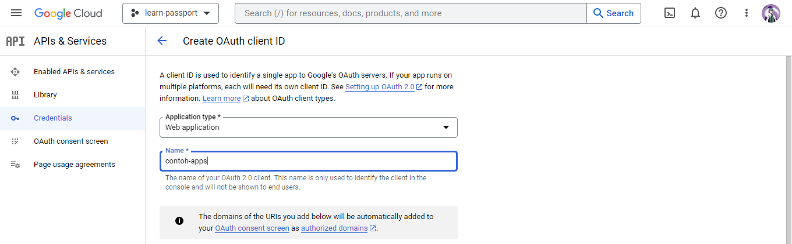

# passport-oauth
<p>Sample code dan contoh penggunaan library Passport untuk authentikasi google</p>

## Penggunaan
<a href='https://expressjs.com'></a>
<a href='https://expressjs.com'></a>
<a href='https://expressjs.com'></a>
<a href='https://expressjs.com'></a>
<p>Sebelum menjalankan aplikasi ini, kalian terlebih dahulu harus menginstall dependency packages dan membuat Credential API Google terlebih dahulu. Untuk menginstall dependency packages jalankan perintah berikut</p>

```bash
npm install
```

<p>Lalu, dilanjutkan menginstall dependency. Lanjut untuk mengcompile file Typescript. Jalan perintah berikut</p>

``` bash
npx tsc 
```
<p>Setelah melakukan compile, akan ada folder tambahan bernama "dist". Selanjutnya kita akan membuat API Credential. Silahkan kunjungi <a href="https://console.cloud.google.com">Console Google Cloud</a></p>
<ul>
	<li>Pilih menu API's and Services.</li>
	<li>Di bagian sidebar atau menu di bagian kiri pilih Credentials.</li>
	<li>Buat credential baru dengan mengklik Create Credential.</li>
	<li>Pilih OAuth2 client ID.</li>
	<li>Pada application type. Pilih Web Application.</li>
	<li>Bagian Authorized Javascript Origins. Silahkan diisi dengan URL Server Node JS. Contoh, di sini aplikasi NodeJS menggunakan port 3001, jadi silahkan isi http://localhost:3001.
	</li>
	<li>Pada Authorized redirect URIs. Silahkan diisi routes yang akan digunakan sebagai callback Authorization. Pada aplikasi NodeJS ini, saya memutuskan menggunakan route http://localhost:3001/auth/google/callback sebagai callback route untuk menghandle Authorization
	</li>
</ul>


<p>Setelah membuat API Credentials. Buka file "PassportConfig.ts" pada folder "middlewares". Isikan credentials pada baris kode yang sudah saya komentari.</p>

``` bash
npm run start-server
```
<p>Coba bukalah browser. Lalu masuk ke url http://localhost:3001/auth/google.</p>
<p>Begitulah cara penggunaan library Passport untuk authentikasi google</p>

